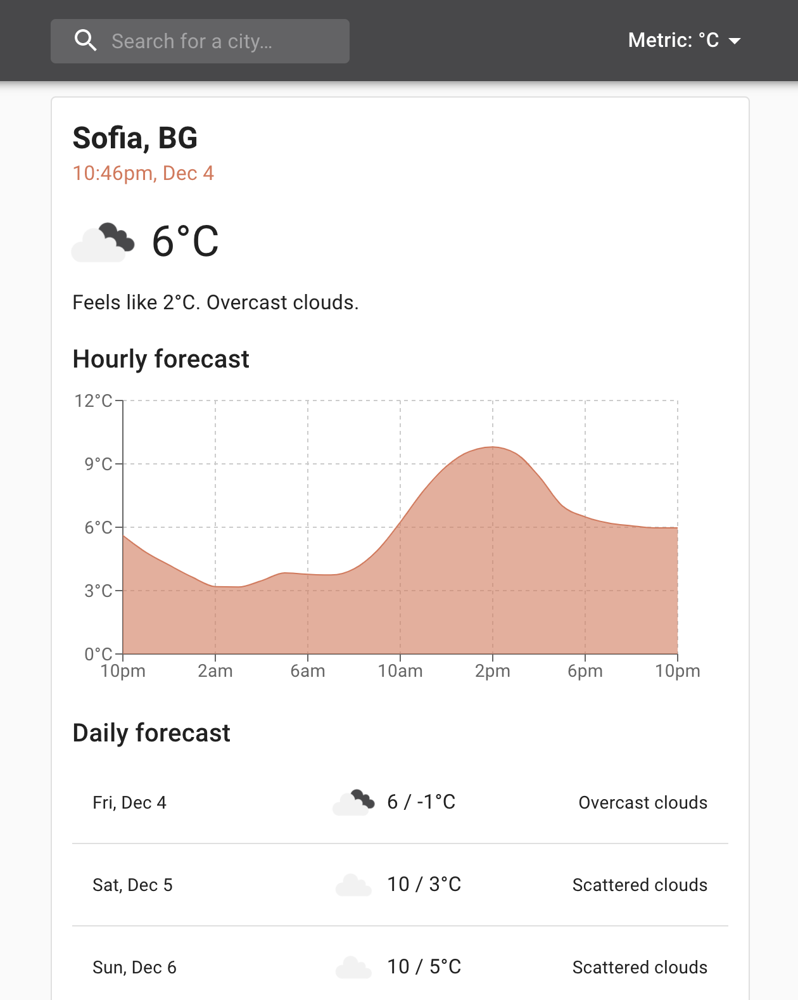

# Weather App
Test PR
App displaying weather data, built using [TypeScript](https://github.com/microsoft/TypeScript), [React](https://github.com/facebook/react) and [Recoil](https://github.com/facebookexperimental/Recoil). The app shows information about the current weather in a given city, as well as hourly and daily forecasts. Both metric and imperial units are supported.

Weather data is retrieved via the [OpenWeatherMap API](https://openweathermap.org/api). The UI is implemented with [Material-UI](https://github.com/mui-org/material-ui) components. Testing is done using [Storybook](https://github.com/storybookjs/storybook) for rendering components in isolation with mocked data, and [Cypress](https://github.com/cypress-io/cypress) for running tests inside headless Chrome.

## Local development

The app uses [Yarn](https://github.com/yarnpkg/berry) for package management. You can install it by running:

```fish
npm install -g yarn
```

You need an [API key](https://openweathermap.org/appid) in order to run the app. Set the API key using the env variable `OPENWEATHERMAP_API_KEY`:

```fish
export OPENWEATHERMAP_API_KEY="..."
```

### Install dependencies

```fish
yarn install
```

### Run the app in development mode

```fish
yarn start
```

### View components in isolation

```fish
yarn storybook
```

### Run integration tests

```fish
yarn test
```

### Bundle the app in production mode

```fish
yarn build
```

### Run the app locally with Docker

```fish
docker build --build-arg OPENWEATHERMAP_API_KEY=$OPENWEATHERMAP_API_KEY -t weather-app:0.1.0 .
docker run -d -p 5000:5000 weather-app:0.1.0
```

## Example


